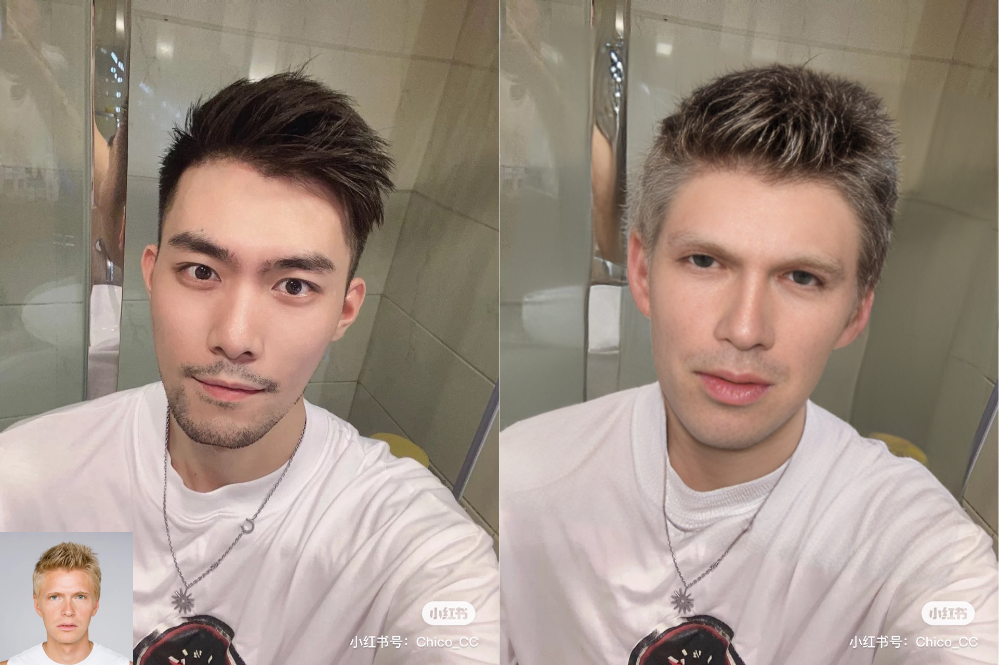
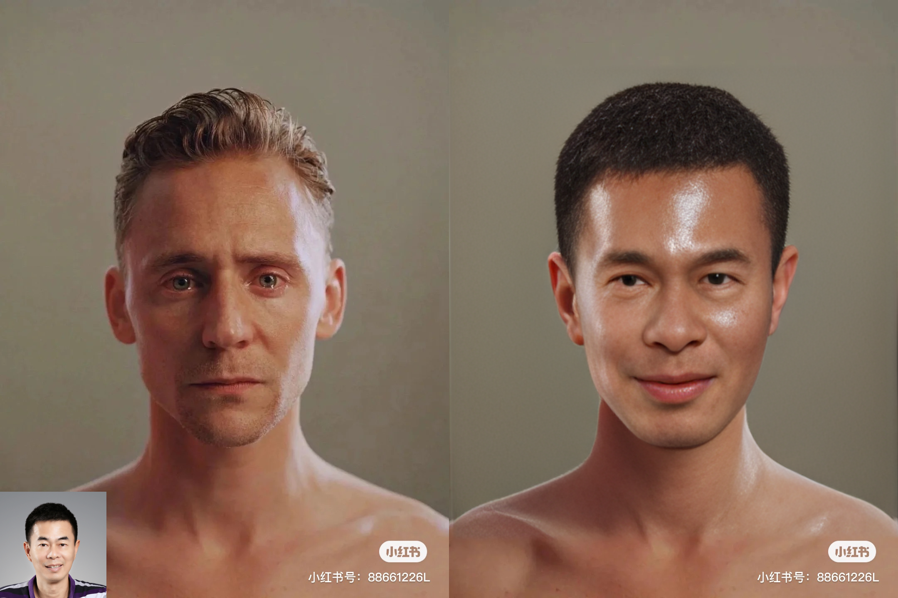

# HeadSwap
This is a HeadSwap project, mainly inspired by [HeSer.Pytorch](https://github.com/LeslieZhoa/HeSer.Pytorch)<br>
It includes two stages<br>
1.  One stage  deeply copy from [PIRender](https://github.com/RenYurui/PIRender)<br>
2. The other stage is from [HeSer.Pytorch](https://github.com/LeslieZhoa/HeSer.Pytorch)
## !!!!! NEW !!!!
Fix enviroment bug！！！<br>
Colab notebooks: 
* single image infer: [](https://colab.research.google.com/github/LeslieZhoa/HeadSwap/blob/main/infer.ipynb)
## Some examples
the pictures is from [小红书](https://www.xiaohongshu.com/) and [baidu](https://www.baidu.com)





## Reference
super resolution -> [CF-Net](https://github.com/ytZhang99/CF-Net)<br>
face parsing -> [face-parsing.PyTorch](https://github.com/zllrunning/face-parsing.PyTorch)<br>
3dmm -> [Deep3DFaceRecon_pytorch](https://github.com/sicxu/Deep3DFaceRecon_pytorch)
## How to Run
1. envrionment<br>
    cuda 11.7,torch1.13.1
    ```
    conda create -n headswap python==3.10.12
    conda activate headswap
    pip install -r requirements.txt 
    ```
    LVT in this project is follow [here](https://github.com/LeslieZhoa/LVT)
2. download model<br>
    a. follow Deep3DFaceRecon_pytorch(https://github.com/sicxu/Deep3DFaceRecon_pytorch#prepare-prerequisite-models), download BFM files and epoch_20.pth in pretrained_models <br>
    b. follow [PIRender](https://github.com/RenYurui/PIRender/blob/main/scripts/download_weights.sh), put epoch_00190_iteration_000400000_checkpoint.pt to pretrained_models<br>
    c. 
    ```
    cd process
    bash download_weight.sh
    ```
    files like this:<br>
    ```
    pretrained_models/
    ├── BFM
    │   ├── 01_MorphableModel.mat
    │   └── similarity_Lm3D_all.mat
    ├── Blender-401-00012900.pth
    ├── epoch_00190_iteration_000400000_checkpoint.pt
    ├── epoch_20.pth
    ├── parsing.pth
    └── sr_cf.onnx
    ```
3. run 
    ```py
    # set your own image path in inference.py
    python inference.py
    ```

## Credits
HeSer.Pytorch model and implementation:
https://github.com/LeslieZhoa/HeSer.Pytorch Copyright © 2022,LeslieZhoa License https://github.com/LeslieZhoa/HeSer.Pytorch/blob/main/LICENSE

PIRender model and implementation:
https://github.com/RenYurui/PIRender Copyright © 2021,RenYurui. License https://github.com/RenYurui/PIRender/blob/main/LICENSE.md

CF-Net model and implementation:
https://github.com/ytZhang99/CF-Net Copyright © 2021,ytZhang99. 

Deep3DFaceRecon_pytorch model and implementation:
https://github.com/sicxu/Deep3DFaceRecon_pytorch Copyright © 2021,sicxu. License https://github.com/sicxu/Deep3DFaceRecon_pytorch/blob/master/LICENSE

arcface pytorch model pytorch model and implementation:
https://github.com/ronghuaiyang/arcface-pytorch Copyright © 2018, ronghuaiyang.

LVT model and implementation:
https://github.com/LeslieZhoa/LVT Copyright © 2022, LeslieZhoa.

face-parsing model and implementation:
https://github.com/zllrunning/face-parsing.PyTorch Copyright © 2019, zllrunning.
License https://github.com/zllrunning/face-parsing.PyTorch/blob/master/LICENSE
